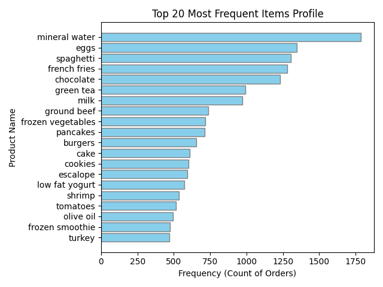
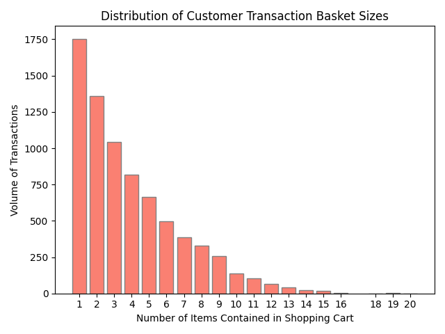

# 🛒 Market Basket Intelligence Engine

An end-to-end data science and unsupervised machine learning pipeline that transforms raw, unformatted grocery transaction logs into actionable product cross-selling insights and structural retail analytics.

---

## 📌 Project Overview & "Why"

In retail and e-commerce setups, millions of transaction records are generated daily. However, analyzing individual item popularities isn't enough to drive business decisions. To maximize profit margins, companies need to discover **hidden product relationships**—frequently co-occurring patterns within customer shopping carts. 

This project implements **Association Rule Learning** from scratch using pure Python and Pandas. By parsing over **7,501 transactions**, it maps statistical connections between products. This mathematical model provides actionable patterns that retailers can leverage to:
- Optimize physical shelf layout configurations and item placements.
- Engineer recommendation algorithms (such as *"Frequently Bought Together"* widgets).
- Design targeted bundle discounts and marketing strategies.

---

## 📊 Exploratory Data Analysis & Visualizations

The data pipeline runs a complete preprocessing phase and outputs mathematical distributions to decode checkout patterns before executing machine learning models:

### 1. Consumer Demand Distribution
This chart analyzes overall product popularity across the entire historical sequence. It explicitly highlights that core grocery staples like `mineral water`, `eggs`, and `spaghetti` dominate transaction volume.
<br>


### 2. Shopping Cart Size Concentrations
This distribution uncovers shopping cart capacities. It indicates a right-skewed layout: the majority of store customers buy 1 to 4 products per visit, highlighting that transactional cross-selling efforts must be focused on small, high-impact product bundles.
<br>


---

## ⚙️ How It Works: The Data Pipeline Blueprint

The pipeline bypasses external pattern-mining frameworks like `mlxtend` to ensure highly optimized runtime constraints using native math:

[Raw store_data.csv Log]
│
▼
[Preprocessing & Sanitization] ──► Removes whitespace & filters out empty NaN array indices.
│
▼
[Frequency Tokenization Map]  ──► Compiles Counter lookups for individual items and paired itemsets.
│
▼
[Combinatoric Association]    ──► Calculates baseline thresholds (Support, Confidence, and Lift).
│
▼
[Production Report Generator] ──► Automatically exports the entire rule warehouse to a clean CSV spreadsheet.

### The Key Mathematical Metrics Used:
1. **Support ($S$):** The fractional probability that a shopping cart contains both Item A and Item B.
2. **Confidence ($C$):** The reliable probability that a customer will purchase Item B *given* that they have already placed Item A in their cart.
3. **Lift ($L$):** The ultimate strength metric. A Lift greater than 1 proves that Item A directly increases the baseline probability of purchasing Item B.

---

## 🧠 Core Insights Discovered (Top Machine Learning Rules)

The engine successfully evaluated all permutations and output a production report (`market_basket_rules_report.csv`). The top patterns mined highlight strong consumer affinities:

| Antecedent (If) | Consequent (Then) | Support | Confidence | Lift | Business Action Opportunity |
| :--- | :--- | :---: | :---: | :---: | :--- |
| **herb & pepper** | ground beef | 1.60% | 32.35% | **3.2920** | Place specialized spices adjacent to the fresh meat aisle to capture immediate up-selling. |
| **tomatoes** | frozen vegetables | 1.61% | 23.59% | **2.4745** | Run cross-category discounts linking fresh produce items directly to frozen storage assets. |
| **shrimp** | frozen vegetables | 1.67% | 23.32% | **2.4466** | Optimize seafood display visibility near standard frozen meal sections. |
| **soup** | milk | 1.52% | 30.08% | **2.3212** | Implement a digital recipe recommendation bundle linking soups with core dairy bases. |

---

## 🛠️ Repository File Architecture

```text
├── store_data.csv                 # Raw, un-headed supermarket transaction dataset
├── app.py                         # Complete Python data pipeline (Cleaning -> EDA -> ML Rules)
├── top_items.png                  # Exported Horizontal EDA bar chart (Generated automatically)
├── transaction_sizes.png          # Exported Basket Size distribution chart (Generated automatically)
├── market_basket_rules_report.csv # Mined insights report file exported for business analysts
└── README.md                      # Professional portfolio layout and project presentation


🚀 Execution & Quickstart Guide
1. Requirements
Ensure your Python environment has the baseline packages installed:

Bash
pip install pandas numpy matplotlib mlxtend

2. Running the Engine
Execute the main file script inside your active terminal environment